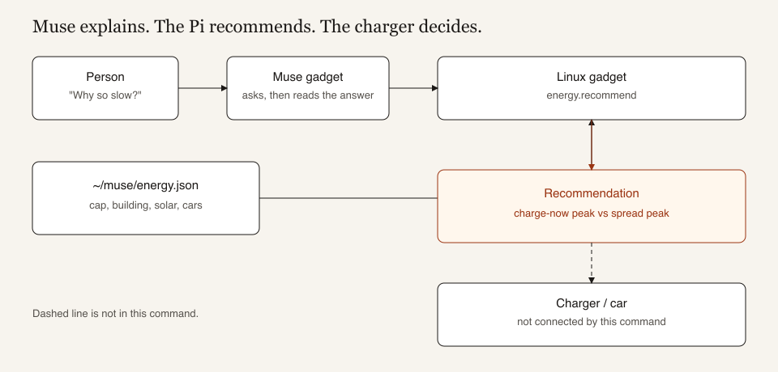
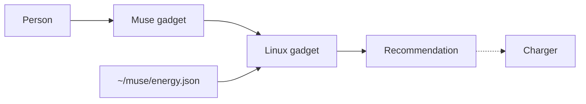
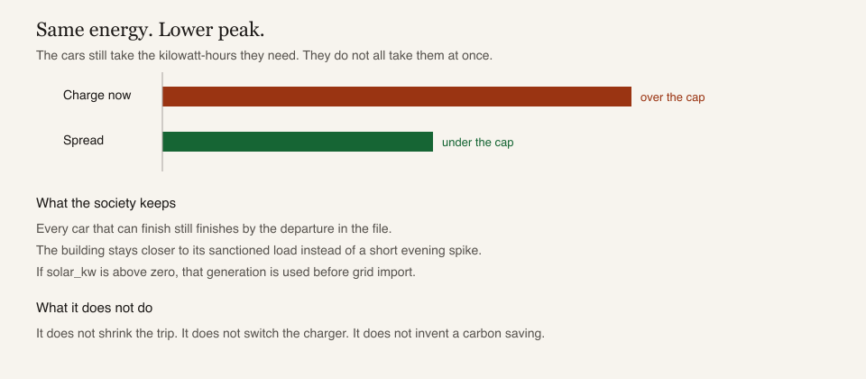

<!--
Copyright (c) Meta Platforms, Inc. and affiliates.

Licensed under the Apache License, Version 2.0 (the "License");
you may not use this file except in compliance with the License.
You may obtain a copy of the License at

    http://www.apache.org/licenses/LICENSE-2.0

Unless required by applicable law or agreed to in writing, software
distributed under the License is distributed on an "AS IS" BASIS,
WITHOUT WARRANTIES OR CONDITIONS OF ANY KIND, either express or implied.
See the License for the specific language governing permissions and
limitations under the License.
-->

# Muse Gadgets

<p align="center">
  <picture>
    <source media="(prefers-color-scheme: dark)" srcset=".github/images/muse-gadgets-dark.png">
    
  </picture>
</p>

Muse gadgets are open source devices you build yourself. Program an
off-the-shelf ESP32 board or set up a Raspberry Pi with our device SDKs, then
connect Muse to your displays, buttons, sensors, actuators, and whatever else
you've got lying on your workbench.

We open sourced the SDKs and firmware here. It's built by hackers, for hackers,
just for fun. Side effects of tinkering may include bricked boards, voided
warranties, brownouts, or bankruptcies. Proceed at your own risk!

| | |
|---|---|
| [**ESP32 Device SDK**](esp32) | Connect your ESP32 board to Muse through our open source SDK. Throw in a screen to show images, add audio in and out, or wire up other sensors. |
| [**Linux Device SDK**](linux) | Turn that spare Raspberry Pi or Linux box into a Muse gadget. Hack in your own commands to let Muse handle sysadmin chores or your Home Assistant setup. |

Before you flash or pair a gadget, get an
[SDK token](https://gadgets.muse.ai/settings/sdk-tokens) and review the
[Gadget SDK Terms](https://gadgets.muse.ai/sdk-terms). Every gadget needs a
token to pair.

ESP32 and Linux gadgets pair with the Muse app on iOS and Android, via
Settings > Devices. Turn on Developer mode there first, then look for devices
prefixed with "MuseGadget".
Each directory has a `README.md` to get started and an `AGENTS.md` for coding
agents like [Muse Code](https://developer.meta.com/ai/lp/muse-code/).

## Community energy

A Linux gadget beside the chargers can tell a housing society why a car is charging slowly, and how to stay under the sanctioned load. Muse is the face. The Pi reads `~/muse/energy.json` and recommends. The charger is not changed.





The solid path is this command. The dashed line is not implemented. A charger would still be allowed to refuse.



If everyone plugs in and takes full power, the evening pile-up can pass the site cap. Many of those cars do not need full power immediately. They need a given amount of plug energy before a departure. `energy.recommend` compares two futures from the same file: charge now at each car's max, or spread that same energy across the hours before departure while staying under the cap.

The kilowatt-hours do not shrink. The trip is the same. What can shrink is the peak, which is the demand the building and the local grid have to carry at once. If `solar_kw` is above zero, that generation is counted before the cap, so daytime charging can use local solar instead of importing the same kilowatt. A file with `solar_kw: 0` is not a renewable saving. Do not describe it as one.

People still choose. Muse explains the cap and names any car that cannot finish. It does not set a charger, spend money, or place an order.

### How to use

1. Install and pair the [Linux gadget](linux/README.md). The command is not on an ESP32 board.
2. On that machine, write `~/muse/energy.json`. `kwh` is energy from the plug, not the battery gauge. `site_limit_kw` is the sanctioned load. The chat cannot change the cap.
3. Restart the service so Muse re-registers the command: `sudo systemctl restart musegadget`
4. Ask: "Why is charging slow? Call energy.recommend first, then explain the cap. Do not change the charger."

```json
{
  "site_limit_kw": 180,
  "building_kw": 100,
  "solar_kw": 0,
  "arrive": "18:00",
  "depart": "07:00",
  "cars": [
    {"name": "A-101", "kwh": 24, "kw_max": 7}
  ]
}
```

Update the file when a car arrives or leaves. A missing file returns this shape as a template and does not guess a site. A bad file returns an error. At most 40 cars. The window must be 15 minutes to 24 hours.

The Pi computes the recommendation from the file even if Muse cloud is down. Muse cloud is only how the sentence reaches the phone. Do not route the decision through a laptop VPN.

### What comes back

| Field | Meaning |
| --- | --- |
| `peak_if_now_kw` | Site load if every car takes max power now |
| `peak_if_spread_kw` | Site load if the same energy is spread under the cap |
| `overload_kw` | How far charge-now passes the cap |
| `on_time` | Every car can still finish by `depart` |
| `late` | Names that cannot finish even when spread |
| `say` | The sentence Muse should read. It ends with "I did not change any charger." |

Checked example, not a measured society: two cars, 3 kWh each, 7 kW max, building 4 kW, cap 10 kW, 18:00 to 20:00. Charge-now peaks at 18 kW. Spread stays at or under 10 kW, and both cars finish.

### What it does not contribute

| Does | Does not |
| --- | --- |
| Show the shared cap before someone overrides it | Shrink the energy a trip needs |
| Keep cars that can finish on time while lowering the pile-up | Set charger power |
| Count solar when the file says it is there | Invent a carbon or rupee saving |
| Work from the file if Muse cloud is down | Speak by itself |

A voice board still needs its own speaker. This command returns text.

## Community

Meet other hackers who are building and customizing Muse gadgets in our
community [Discord](https://discord.gg/3bhjCkZdd6). Get inspired, support each
other, and share what you make.

## License

Muse Gadgets is licensed under the Apache License, Version 2.0, found in
[`LICENSE`](LICENSE), except for these third-party files, which keep their
upstream licenses:

| Path | Upstream | License |
|---|---|---|
| [`esp32/components/minimp3/include/minimp3.h`](esp32/components/minimp3) | [lieff/minimp3](https://github.com/lieff/minimp3) | CC0-1.0, see [`LICENSE`](esp32/components/minimp3/LICENSE) |
| [`esp32/main/pixel_font.c`](esp32/main/pixel_font.c) | Adafruit GFX `glcdfont.c` | BSD-2-Clause, in the file header |

Dependencies fetched at build time are under their own licenses: ESP-IDF
components (into `esp32/managed_components/`), and the simulator's LVGL and
SDL (listed in [`esp32/simulator/THIRD_PARTY.md`](esp32/simulator/THIRD_PARTY.md)).

The Apache License does not cover the [Jollybot avatar](esp32/avatar).
